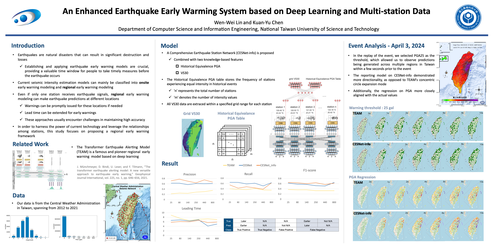
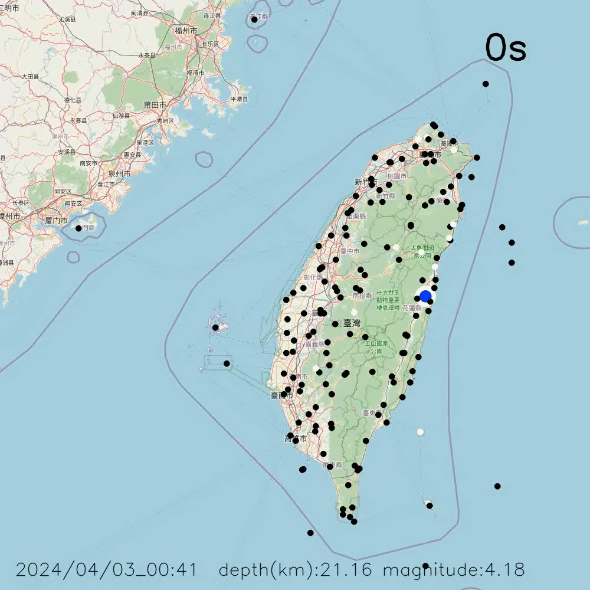
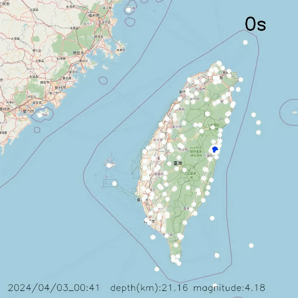

## An Enhanced Earthquake Early Warning System

**Earthquakes can cause tremendous destruction, making effective early warning systems essential.** This project introduces a deep learning-based regional earthquake early warning (EEW) system that leverages multi-station data to improve both accuracy and lead time.

A key innovation in this system is the integration of **vs30** (average seismic shear-wave velocity from the surface to a depth of 30 meters) and **historical equivalence data**, which significantly enhances the model’s performance. By combining these two crucial knowledge sources, the system can more accurately predict seismic events and provide earlier warnings, ultimately mitigating damage and saving lives.

- **Title**: *An Enhanced Earthquake Early Warning System based on Deep Learning and Multi-station Data*
- **Authors**: **Wen-Wei Lin**, Kuan-Yu Chen
- **Conference**: Japan Geoscience Union (JpGU) Meeting 2024
- **Status**: Submitted and accepted, awaiting publication

You can view or download the full paper in PDF format by clicking [here](https://drive.google.com/file/d/1f4mxLFEzwm282NHq5urBkIgXXyVAezYm/view?usp=share_link).

The project poster is also available below:

For further updates, please refer to the [conference website](https://www.jpgu.org/en/).

### Demonstration
**Earthquake Alert at Level 4 Threshold**: This image shows the system's real-time earthquake warning based on the level 4 threshold, demonstrating its response under this specific intensity.
**PGA Regression for Earthquake Prediction**: This image presents the system's regression analysis for Peak Ground Acceleration (PGA), showcasing the model's predictive capabilities.

---
### Abstract
Earthquakes can cause tremendous destruction, making effective early warning systems essential. This project introduces a deep learning-based regional earthquake early warning (EEW) system that leverages multi-station data to improve both accuracy and lead time.

### Key Contributions:
- Development of a deep learning-based model that integrates data from multiple stations for more accurate regional warnings.
- Inclusion of historical statistics and background knowledge to enhance prediction robustness.
- A flexible transformer-based architecture, designed for scalability and adaptation to various datasets and regions.

By utilizing Taiwan’s seismic data, our model demonstrated a significant improvement over traditional onsite methods, offering an average lead time extension of more than 2 seconds.

For more information, you can download the [paper](https://drive.google.com/file/d/1f4mxLFEzwm282NHq5urBkIgXXyVAezYm/view?usp=share_link).
